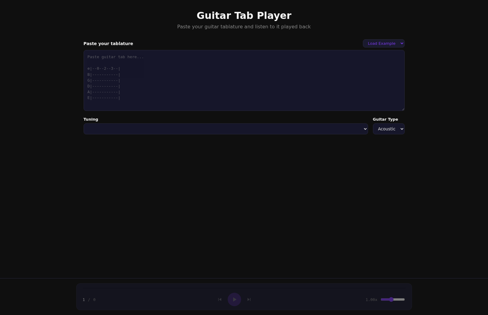
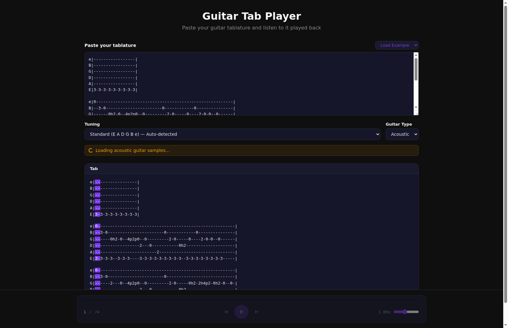

<div align="center">

# Guitar Tab Player

### Paste. Play. Practice.

A web-based guitar tablature player that brings ASCII tabs to life with real sampled guitar sounds.

[](https://svelte.dev/)
[](https://tonejs.github.io/)
[](https://vite.dev/)
[](https://witherredaway.github.io/guitar-tab-player/)

[](https://witherredaway.github.io/guitar-tab-player/)

</div>

---

## Screenshots

<div align="center">

| Paste your tab | Tab loaded & ready to play |
|---|---|
|  |  |

</div>

---

## Features

| Feature | Description |
|---|---|
| **Paste & play** | Paste raw guitar tab text and hear it played back instantly |
| **Auto-detect tuning** | Reads string labels (`e\|`, `B\|`, `G\|`, etc.) to automatically detect tuning |
| **Tuning selector** | Auto-detected, presets (Standard, Drop D, DADGAD, Open G/D/E/A), and custom |
| **Acoustic & electric** | Toggle between real guitar sample sets |
| **Technique support** | Hammer-ons, pull-offs, slides up & down with proper velocity and timing |
| **Player controls** | Play/pause, prev/next chord, clickable progress bar with seeking |
| **Speed control** | Adjustable playback speed from 0.25x to 2.0x |
| **Keyboard shortcuts** | Space (play/pause), arrow keys (prev/next chord) |
| **Tab display** | Real-time playback highlighting with auto-scroll |
| **Example tabs** | Dropdown with two built-in example tabs to try immediately |
| **Responsive** | Works on desktop and mobile |

---

## Tab Format

Supports standard ASCII guitar tablature:

```
e|3----5h8-5h8p5\3-3p0---|
B|------2h4---2p0-2/4-2--|
G|-----------------------|
D|-----------------------|
A|-----------------------|
E|0--0-----0-----0-------|
```

| Symbol | Technique | Example |
|--------|-----------|---------|
| `h` | Hammer-on | `5h8` |
| `p` | Pull-off | `8p5` |
| `/` | Slide up | `2/4` |
| `\` | Slide down | `5\3` |
| `-` | Sustain / rest | `---` |
| `\|` | Measure separator | `\|` |

> Multi-digit fret numbers (10, 12, etc.) are supported. Each block of 6 strings is a sequential section — blocks are played one after another, not simultaneously.

---

## Tech Stack

| Technology | Purpose |
|---|---|
| [**Svelte 5**](https://svelte.dev/) | Reactive UI framework with Runes (`$state`, `$derived`, `$effect`) |
| [**Vite**](https://vite.dev/) | Fast build tool with hot module replacement |
| [**Tone.js**](https://tonejs.github.io/) | Web Audio API library with real guitar samplers |

---

## Project Structure

```
src/
├── App.svelte                    # Main app controller & state management
├── main.js                       # Entry point
├── app.css                       # Global styles & CSS variables
├── lib/
│   ├── tabParser.js              # Tab text → structured timeline parser
│   └── audioEngine.js            # Tone.js audio engine (samplers, playback)
└── components/
    ├── TabInput.svelte           # Textarea + example tab dropdown
    ├── TuningSelector.svelte     # Tuning dropdown (auto-detect, presets, custom)
    ├── GuitarTypeSelector.svelte # Acoustic/Electric selector
    ├── PlayerControls.svelte     # Transport controls, speed slider, progress bar
    └── TabDisplay.svelte         # Visual tab rendering with highlighting
```

---

## How to Run

### Prerequisites

- [Node.js](https://nodejs.org/) (v18 or later)
- npm (comes with Node.js)

### Development

```bash
# Clone the repo
git clone https://github.com/WitherredAway/guitar-tab-player.git
cd guitar-tab-player

# Install dependencies
npm install

# Start the dev server (with hot reload)
npm run dev
```

The app will be available at `http://localhost:5173/guitar-tab-player/`.

### Production Build

```bash
# Build for production
npm run build

# Preview the production build locally
npm run preview
```

### Deployment

The project includes a GitHub Actions workflow for automatic deployment to GitHub Pages. After merging to `main`:

1. Go to repo **Settings → Pages → Source**
2. Select **GitHub Actions**
3. The site will auto-deploy on every push to `main`
